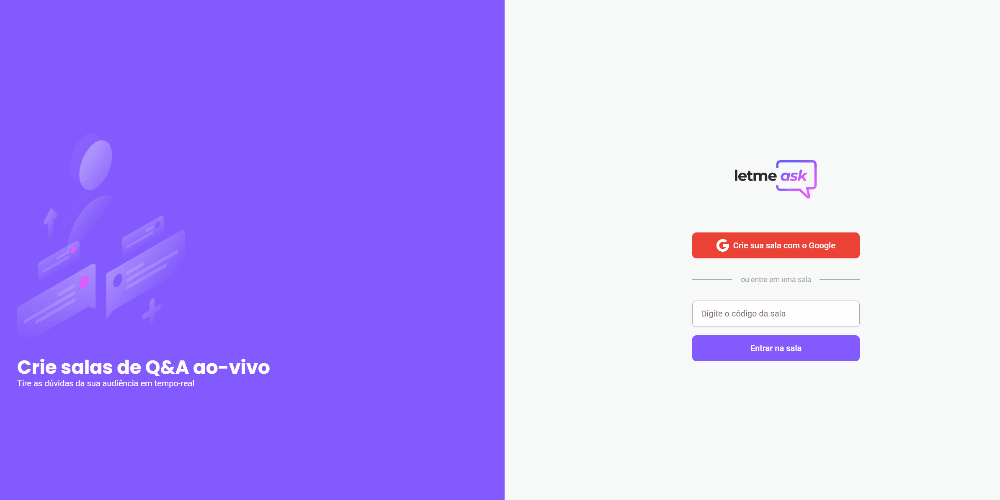

<h1 align="center">
    
</h1>

 

##  🚀 Technologies

- ReactJS
- Firebase
- TypeScript

## 💻 Project

Letmeask is perfect for content creators to be able to create Q&A rooms with their audience, in a very organized and democratic way.

This is a project developed during the Next Level Week Together in 2021.

## 🔖 Layout

You can view the layout of the project via the link below:

- [Web Layout](https://www.figma.com/community/file/1009824839797878169/Letmeask)

## 📝 License

This project is under the MIT license. See the [LICENSE](LICENSE.md) file for more details.

---

Made by Breno.
